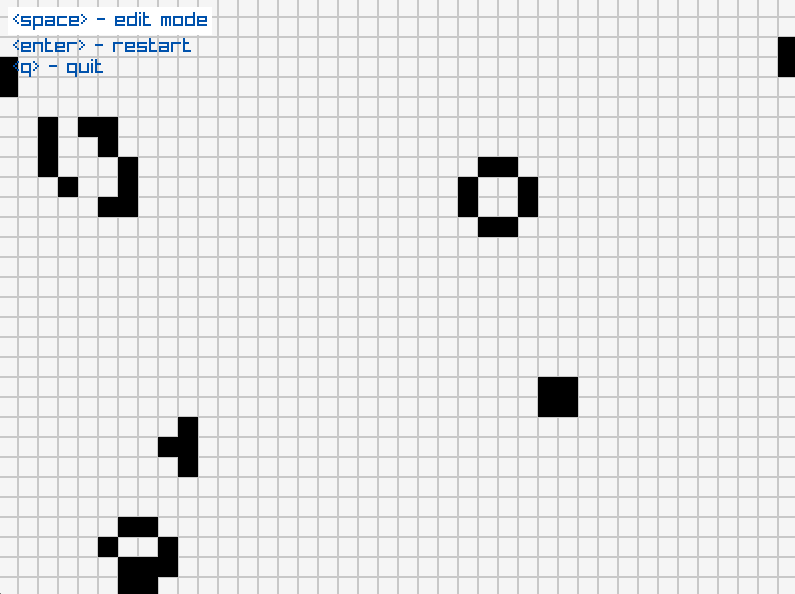
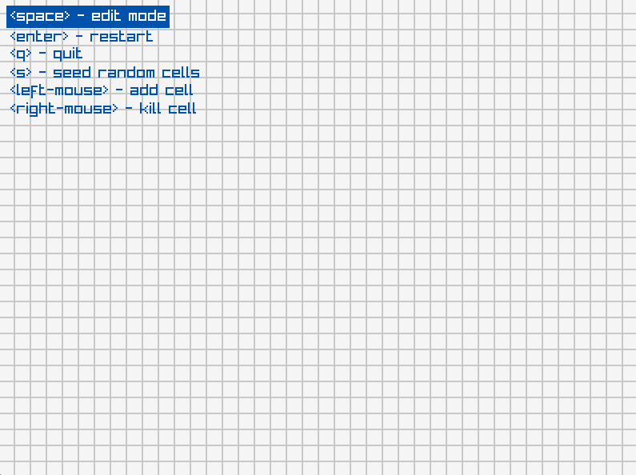
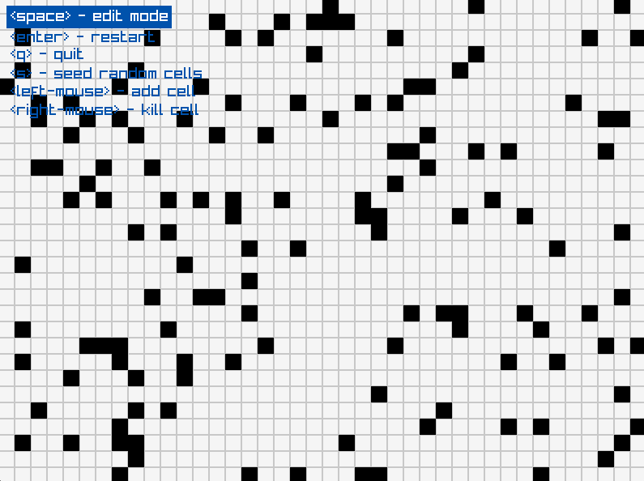

# Conway's Game of Life

Conway's Game of Life written in Go with [raylib](https://github.com/raysan5/raylib).



# Requirements

- [Go](https://go.dev/)
- [raylib](https://github.com/raysan5/raylib)

# Simulation Interaction

The simulation starts in `edit` mode:



One can use the:
- `space` key to toggle between editing or running the simulation
- `right-mouse` button to add cells
- `left-mouse` button to remove cells
- `s` key to to seed the Petri dish with random cells



- `enter` key to restart with a clean Petri dish
- `q` key to quit

# Build

```bash
go build cmd/main.go
```

# Run

```bash
go run cmd/main.go
```
